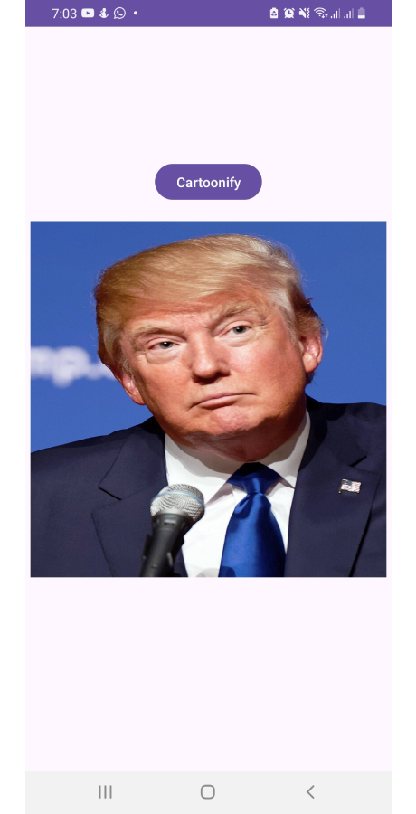
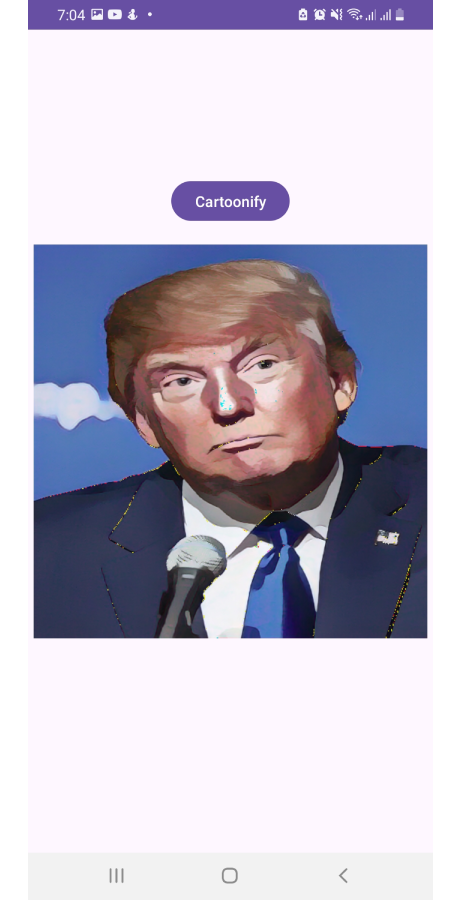

# 

# Cartoonix

Cartoonix is an Android application that uses a TensorFlow Lite model to transform regular images into cartoon-style images. Built with Kotlin, this app demonstrates the implementation and use of machine learning models on mobile devices.

## Features

- **Cartoon Transformation**: Convert any image to a cartoon style using the CartoonGAN model.
- **Seamless Processing**: Efficient image processing with TensorFlow Lite.
- **User-Friendly Interface**: Simple image upload and transformation.

## Getting Started

### Prerequisites

- Android Studio
- Android SDK
- Minimum SDK version: 26 (Oreo)
- Target SDK version: 34

### Installation

1. **Clone the Repository**:

    ```sh
    git clone https://github.com/razasaeed/Cartoonix.git
    cd Cartoonix
    ```

2. **Open in Android Studio**:

    - Open Android Studio.
    - Select "Open an existing project".
    - Navigate to the cloned repository and select it.

3. **Build and Run**:

    - Ensure you have an Android device or emulator set up.
    - Click on "Run" to build and deploy the app.

## Usage

Currently, users cannot select images from the gallery or capture images from the camera. This feature is planned for future updates. For now, users can place an image in the `drawable` folder and use it.

1. **Place an Image in Drawable**:

    - Add your image to the `res/drawable` directory in your Android project.

2. **Run the App**:

    - The app will process the image in the `drawable` folder and display the cartoonized version.

## Future Work

- Implement functionality to select images from the gallery.
- Implement functionality to capture images from the camera.

## Contributing

Contributions are welcome! Feel free to submit a pull request or open an issue to discuss any changes or improvements.

## License

This project is licensed under the MIT License - see the [LICENSE](LICENSE) file for details.

## Screenshots

<table>
  <tr>
    <td align="center"><b>Original Image</b></td>
    <td align="center"><b>Cartoonized Image</b></td>
  </tr>
  <tr>
    <td align="center"></td>
    <td align="center"></td>
  </tr>
</table>

## Authors

- [Raza Saeed](https://github.com/razasaeed)

## Acknowledgments

- Thanks to [TensorFlow](https://www.tensorflow.org/lite) for providing the tools to build this app.
